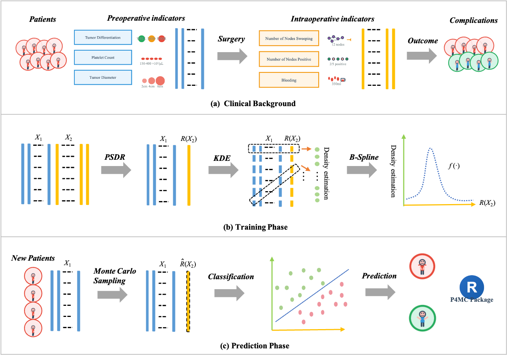

<div align="center">
  
</div>

> **The Framework of P4MC.**
>
> **(a) Clinical Background:** The study utilizes three data sources: preoperative indicators, intraoperative indicators generated during surgery, and postoperative complication outcomes.
>
> **(b, c) Methodological Framework:** The proposed method processes the collected data in four steps:
> * **Step 1: Dimension Reduction.** Perform Partial Sufficient Dimension Reduction (PSDR) to compress the high-dimensional *X₂* into a scalar sufficient predictor *R(X₂)*.
> * **Step 2: Density Estimation.** Estimate the joint distribution of *X₁* and *R(X₂)* using Kernel Density Estimation (KDE) on a multidimensional grid.
> * **Step 3: Distribution Modeling and Sampling.** For a new patient with unobserved intraoperative data, fit the conditional distribution using B-spline interpolation and generate latent Monte Carlo samples via the Metropolis-Hastings (MH) algorithm.
> * **Step 4: Risk Prediction.** Apply the trained classifiers to the generated samples to calculate the probability of complications, enabling the final binary classification.

<br>

# P4MC

P4MC: A Monte Carlo Classification Method Based on Partial Variables for Postoperative Complication Prediction

## Abstract
Predicting postoperative complications is a critical task for improving patient care and optimizing resource management. We frame this challenge as a binary classification problem utilizing two-stage clinical data: preoperative and intraoperative variables. A major obstacle for this task is the unavailability of intraoperative data for preoperative prediction. Existing approaches, which typically rely solely on preoperative data or single intraoperative indicator imputation, often fail to capture critical predictive information.

To provide a more robust solution, we propose a novel method, **P4MC** (**P**reoperative, **P**artial intrao**P**erative, **P**ostoperative **M**onte **C**arlo classification). This approach explicitly models the dependency between the two stages to recover latent intraoperative information. Specifically, P4MC leverages Partial Dimension Reduction to compress high-dimensional intraoperative variables into a low-dimensional sufficient predictor. By employing Monte Carlo sampling on the conditional distribution of two-stage data, we generate latent features to serve as inputs for a classification model. The effectiveness of P4MC is validated through extensive simulation experiments. Furthermore, we demonstrate its practical utility on two real-world cancer cohorts: laparoscopic pancreaticoduodenectomy and hepatocellular carcinoma, showing that our method outperforms traditional machine learning models and yields clinically meaningful insights.


## Installation

You can install the development version of P4MC directly from GitHub:

```r
# Install devtools if you haven't already
if (!requireNamespace("devtools", quietly = TRUE))
    install.packages("devtools")

# Install P4MC
devtools::install_github("501fox/P4MC")
```

## Usage
Here is a standard pipeline to load the data and run the P4MC prediction models:

```r
library(P4MC)

# 1. Load the example datasets
data("data_simulation")
data("data_LPD")

# 2. Single Run Evaluation
# For Simulation Data:
results_sim <- run_P4MC_multi_sim(
  datasets = data_simulation,
  k = 10,                    
  calculate_auc = TRUE,
  classifiers = c('logistic', 'svm', 'rf', 'xgboost') 
)

# For LPD Real Data (includes internal SMOTE processing):
results_LPD <- run_P4MC_multi_LPD(
  datasets = data_LPD,
  k = 5,              
  calculate_auc = TRUE,
  classifiers = c('logistic', 'svm', 'rf', 'xgboost')
)

# 3. View Results
print(results_sim$SummaryTable)
print(results_LPD$SummaryTable)

# Optional: If you want to run multiple replications (e.g., to compute CI), 
# you can easily wrap the function in a simple loop:
# results_list <- lapply(1:5, function(s) {
#   run_P4MC_multi_LPD(datasets = data_LPD, k = 5, seed = s, calculate_auc = TRUE)
# })